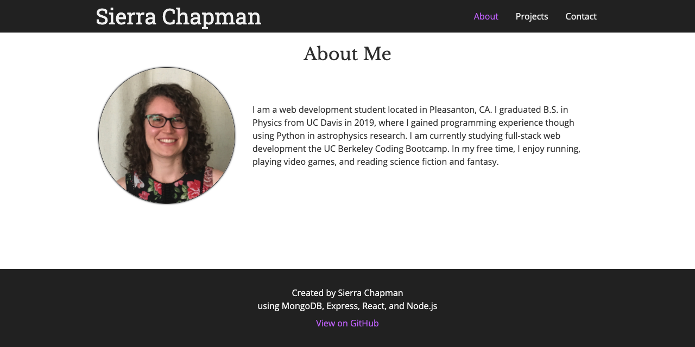
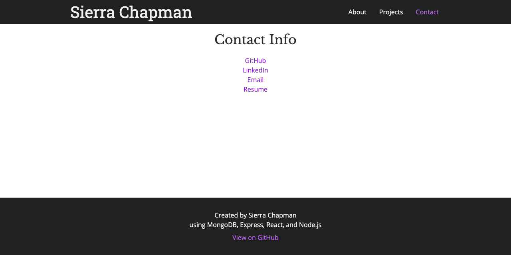
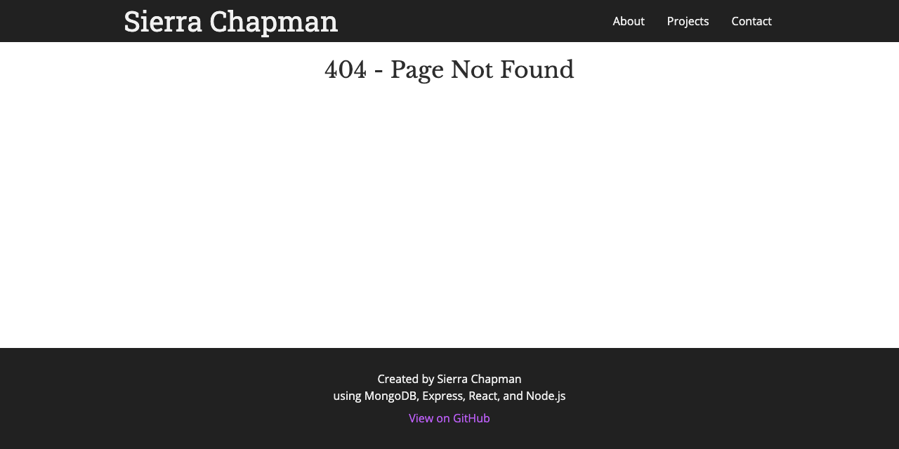

# React Portfolio


## Description

This portfolio website features a responsive frontend built with React, an Express server run in a Node.js environment on Heroku, and project data stored on a MongoDB database.

## Table of Contents


* [Deployed Link](#deployed-link)

* [Preview](#preview)

* [Technologies Used](#technologies-used)

* [Installation](#installation)

* [License](#license)

* [Questions](#questions)


## Deployed Link

* [See Live Site](https://react-portfolio-sc.herokuapp.com/)

## Preview

The website has four pages: an about page, a projects page, a contact page, and a 404-error page.

### The About Page



### The Projects Page


### The Contact Page



### The 404 Error Page



## Technologies Used

* [React](https://reactjs.org/)
* [HTML](https://developer.mozilla.org/en-US/docs/Web/HTML)
* [CSS](https://developer.mozilla.org/en-US/docs/Web/CSS)
* [JavaScript](https://developer.mozilla.org/en-US/docs/Web/JavaScript)
* [MongoDB](https://www.mongodb.com/)
* [Git](https://git-scm.com/)
* [GitHub](https://github.com/)
* [Heroku](https://www.heroku.com/)
* [Google Fonts](https://fonts.google.com/)
* [Node.js](https://nodejs.org/en/)
* [Node Package Manager (NPM)](https://www.npmjs.com/)
* [Axios](https://www.npmjs.com/package/axios)
* [Express](https://expressjs.com/)
* [Mongoose](https://mongoosejs.com/)

## Installation

No installation is needed to experience the deployed website. To run a development version of the website, follow these steps.

After downloading this repository, run the following command inside the repository to install the necessary dependencies:

```
npm install
```

To seed the database, run the following command:

```
npm run seed
```

To start the development server, run this command:

```
npm start
```

## License

This project is licensed under the MIT license.

## Questions

If you have any questions about the repo, open an issue or contact me directly at siechap@gmail.com. You can find more of my work at [SierraChapman](https://github.com/SierraChapman/).

